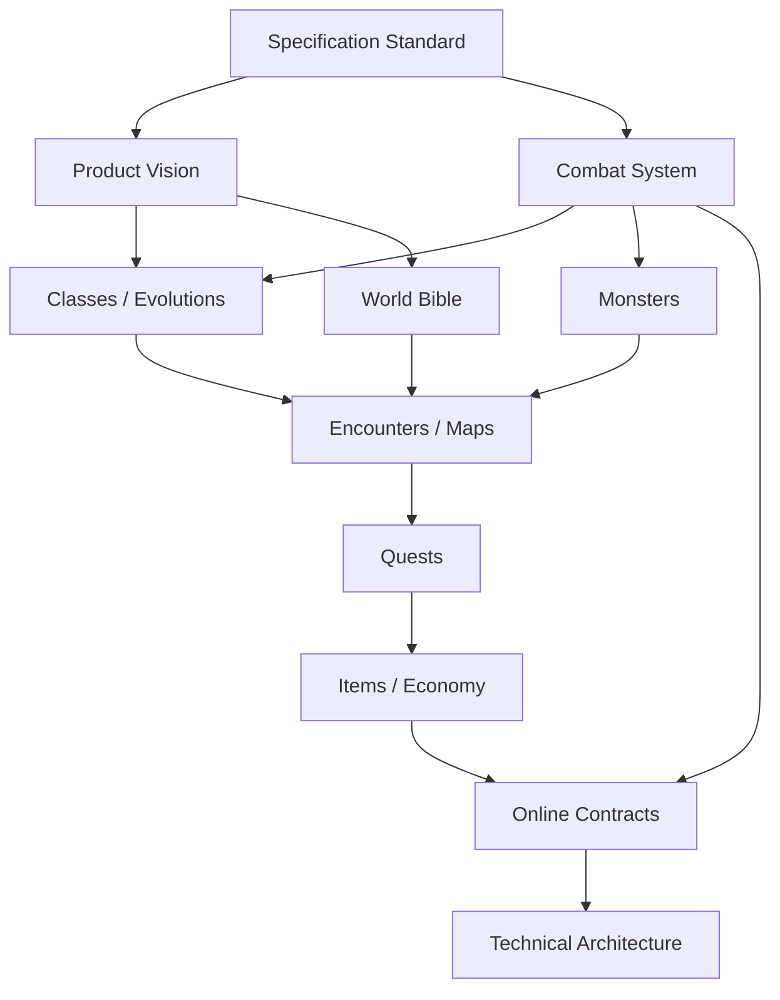

# Dependency Map

## Graphe logique

## Chargement minimal par type de tâche

| Tâche | Modules obligatoires |
|---|---|
| ajouter une compétence | standard, combat, classe ou évolution propriétaire |
| ajouter un monstre | standard, combat, catalogue monstre, map cible |
| modifier une map | standard, exploration, monde, monstres et quêtes référencés |
| modifier une récompense | progression, économie, objets, quête/monstre source |
| générer un client | UX, contenu, contrats online, exigences non fonctionnelles |
| générer un serveur | combat, économie, modèle de domaine, contrats et sécurité |

## Règle anti-couplage

Une classe ne référence jamais directement une map. Une map référence les
monstres qu’elle accueille. Une quête peut référencer classes, maps, monstres et
objets, mais ces modules ne dépendent pas de la quête. Cela permet de supprimer
ou remplacer une quête sans modifier le gameplay fondamental.
