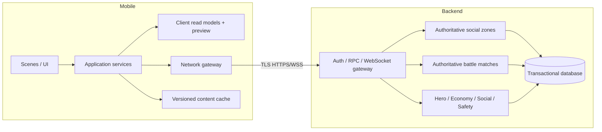

# Dossier d’Architecture Technique (DAT)

## Objective

Architecture de référence pour générer un client mobile 2D et un backend MMO
autoritaire. Un outil peut remplacer une technologie, mais doit conserver les
frontières, contrats et invariants de ce document.

## Reference implementation profile

| Layer | Baseline | Replaceable if |
|---|---|---|
| mobile client | Godot 4.x, GDScript, 2D | mobile export, accessibility and deterministic preview remain |
| game backend | Nakama authoritative runtime | auth, presence, RPC, matches and social contracts remain |
| server language | TypeScript-compatible runtime | deterministic domain and validation remain |
| database | PostgreSQL 17+ | ACID, constraints, audit and backups remain |
| content delivery | immutable signed bundle/CDN | version/hash/fallback remain |
| local environment | containers/Compose | one-command reproducibility remains |

Versions exactes sont verrouillées au début d’un incrément et modifiées par ADR.

## Container view

## Client boundaries

- UI renders state and emits intent; no direct persistence.
- Application layer coordinates flows and cancellation.
- Domain preview may calculate public movement/damage but is never authoritative.
- Network gateway is the only SDK/provider dependency.
- Content registry exposes typed content by stable ID.
- Local storage contains preferences, content cache and safe resume metadata only.
- Tokens use platform secure storage, never logs or plain preferences.

Required client states: boot, content check, authentication, onboarding, hub,
world, battle, den, social overlay, reconnect, maintenance and forced update.

## Server domains

| Domain | Responsibilities |
|---|---|
| Account | auth linking, age/consent, export/delete |
| Hero | creation, appearance, loadouts, evolution |
| World | zones, checkpoints, discovery, presence validation |
| Combat | match state, rules, AI, results |
| Economy | inventory, wallet, craft, claims, ledger |
| Trade | offers, escrow, confirmation, completion |
| Social | friends, parties, guilds, den permissions |
| Safety | filter, block, report, sanctions |
| LiveOps | flags, seasons, world projects, inbox |
| Telemetry | allowlisted events without unnecessary PII |

Domains communicate through explicit commands/events. Economy never accepts an
inventory delta from Combat; it accepts a verified `MatchCompleted` result ID.

## Authoritative flows

### Boot

Authenticate → bootstrap account/versions → compare client/protocol/content →
resume or enter safe checkpoint → open realtime channel.

### Battle

Create/match → join → snapshot → player intent → validate → apply pure rule →
append ordered events → broadcast → finish → persist result → separate idempotent
reward claim.

### Trade

Propose → validate eligibility → edit offers → lock assets → 5-second review →
two confirmations over same hash/version → atomic exchange + ledger → receipt.

## Data ownership

Server owns position legality, quest progress, XP, class/evolution, combat, loot,
inventory, wallet, trade, den published version and sanctions. Client owns control
preferences, unsaved den draft and non-authoritative presentation cache.

## Versioning

- `client_version`: app SemVer.
- `protocol_version`: integer, current `1`.
- `content_version`: SemVer, current `0.1.0`.
- `balance_version`: integer, current `1`.
- A battle pins content/balance versions until completion.
- Server may accept protocol N-1 only with explicit compatibility adapter.

## Environments

`local`, `dev`, `staging`, `production`; separate identities, databases, object
stores, purchase credentials and analytics. No production personal data in lower
environments. Feature flags are environment-scoped and audited.

## Deployment principles

Build once, promote same immutable artifact. Database migrations are forward,
backward-compatible during rollout and verified before traffic. Server canary,
kill switches for chat/trade/purchases, and rollback application without blind DB
rollback.

## Open technology decisions

Cloud, moderation vendor, analytics vendor, push provider, exact store validation
service and soft-launch regions remain undecided. A generator MUST expose them as
interfaces/configuration, not invent a production vendor or secret.

## Architecture acceptance criteria

- Client cannot grant itself reward or change battle outcome.
- Every economic mutation is atomic, idempotent and auditable.
- Provider SDKs are isolated behind gateways.
- Content changes do not require UI source edits when schema-compatible.
- Reconnection restores safe state without duplicate action/reward.
- Safety kill switches function independently of application deployment.
