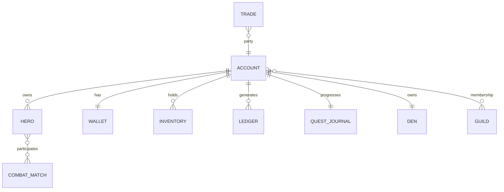

# Domain Model

## Identifier rules

Persistent entities use server-generated UUID. Content uses stable dotted IDs.
Names are never primary keys. Timestamps are UTC. Mutable aggregates have integer
`version` starting at 1.

## Aggregates

### Account

`account_id`, provider identities, region, locale, age band, consent, status,
privacy settings, created/updated/deletion dates. Account is security boundary.

### Hero

`hero_id`, account, display name, class ID, optional evolution ID, level, XP,
appearance, equipment, three loadouts, mastery, checkpoint, version. MVP allows
one active hero per account; model SHOULD support more later.

### Inventory

Stacks keyed by account + item + binding reason. Unique instances for equipment
and placed decorations when state differs. Quantity ≥0, stack cap enforced.

### Wallet and EconomyLedger

Wallet contains balances. Every delta produces immutable ledger entry with
operation, asset, delta, balance after, source, idempotency key and time.

### QuestJournal

Per quest: status, step index, counters, activated/completed timestamps, version
and claim key. Temporary quest assets are marked and cleaned on abandonment.

### Den

Owner, visibility, theme, placements, published version. Placement references a
possessed item instance plus coordinate, rotation and safe visual variant.

### CombatMatch

Mode, participants, content/balance/protocol versions, seed, ordered state,
action-log hash, status, start/end. Live state can be ephemeral; result and claim
facts persist.

### Trade

Parties, versioned offers, escrow, offer hash, confirmation flags, review time,
expiry and state `proposed|locked|review|completed|cancelled|expired|failed`.

### Social

Friendship is canonical ordered account pair; party is ephemeral membership;
guild is aggregate with members/roles/audit; block is unilateral and overrides.

### ModerationCase

Reporter/subject internal IDs, category, evidence references, priority, status,
assignee, actions, appeal and retention class. Reporter identity never exposed.

## Relationship view

## Cross-aggregate invariants

- Evolution belongs to hero class and level permits it.
- Bound item never enters trade escrow.
- Placed or escrowed instance cannot be consumed elsewhere.
- Match reward claimed at most once per account/match.
- Block overrides friend, DM, invite and den access.
- Account deletion anonymizes social references while preserving necessary
  economic/security audit according to retention policy.
